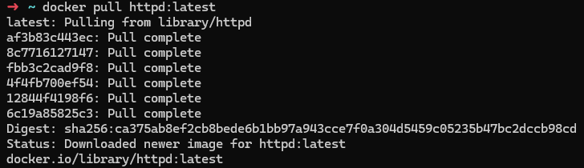
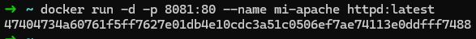
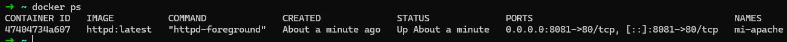
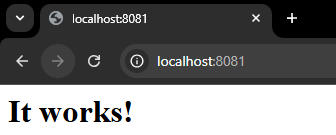
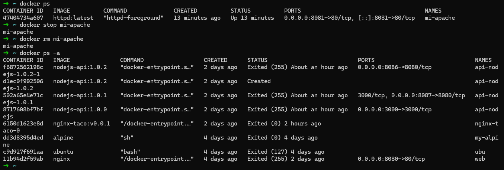

1. Nombre de la aplicación:
   ###  **httpd**

2. Comandos ejecutados - Todos los comandos que usaste, uno por uno:

* Descargar la imagen
```bash
docker pull httpd:latest
```

* Comando docker run completo
```bash
docker run -d -p 8081:80 --name mi-apache httpd:latest
```

* Comandos de verificación
```bash
docker ps
```

* Comandos de limpieza
```bash
docker stop mi-apache
```

```bash
docker rm mi-apache
```

```bash
docker ps
```


3. Explicación breve - Qué hace cada flag del comando docker run que usaste
```bash
docker run -d -p 8081:80 --name mi-apache httpd:latest
```
* -d Ejecuta el container en segundo plano.
* -p Mapea el puerto local 8081 al puerto 80 del container.
* --name mi-apache  Asigna el nombre "mi-apache" al container.
* httpd:latest Especifica la image a usar (httpd).


4. Evidencia:

* Screenshot descargando imagen elegida

  

* Screenshot Comando docker run completo

  

* Screenshot de docker ps mostrando el container corriendo

  

* Screenshot del navegador (si es httpd)

  

* Screenshot o salida mostrando que el container fue eliminado correctamente

  

5. Conclusiones (opcional):

* Qué aprendiste

  Desplegar la aplicación httpd con docker

* Dificultades encontradas y cómo las resolviste

  Al eliminar el container no lo hacía correctamente, me di cuenta que no estaba detenido, por lo que primero lo detuve y luego si lo elimine.