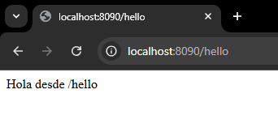

# Dockerfile con Spring Boot

3. Descripción de la Aplicación
   * Lenguaje y framework utilizado
   ### JAVA con SPRING BOOT
   * Endpoints disponibles:
   
     * http://localhost:8090/hello
   
      * http://localhost:8090/saludo 
   

   * Funcionalidad básica

     API REST simple con dos endpoints de saludo:
       * GET /hello - Endpoint que retorna un mensaje de saludo en inglés (probablemente "Hello World" o similar)
       * GET /saludo - Endpoint que retorna un mensaje de saludo en español

2. Dockerfile

   * Dockerfile completo (código fuente)

   ````
   # Stage 1: Build
   FROM gradle:8.7.0-jdk17-alpine AS build
   LABEL stage=build
   WORKDIR /app
   COPY --chown=gradle:gradle . .
   RUN gradle clean build -x test --no-daemon
   
   # Stage 2: Runtime
   FROM openjdk:17-alpine AS runtime
   LABEL maintainer="guidocutipayujra@gmail.com"
   LABEL org.opencontainers.image.source="https://github.com/tu-repo"
   LABEL org.opencontainers.image.description="Spring Boot app con build multi-stage y buenas prácticas Docker"
   
   # Crear usuario no root
   RUN addgroup -S appgroup && adduser -S appuser -G appgroup
   USER appuser
   
   WORKDIR /home/appuser
   
   # Copiar solo el JAR generado
   COPY --from=build /app/build/libs/*.jar app.jar
   
   # Puerto configurable
   ENV APP_PORT=8080
   EXPOSE ${APP_PORT}
   
   # Variables de entorno recomendadas
   ENV JAVA_OPTS=""
   
   # Healthcheck (opcional pero recomendado)
   HEALTHCHECK --interval=30s --timeout=5s --start-period=30s --retries=3 \
   CMD wget --spider -q http://localhost:${APP_PORT}/actuator/health || exit 1
   
   # Comando de arranque
   ENTRYPOINT ["sh", "-c", "java $JAVA_OPTS -jar app.jar --server.port=$APP_PORT"]
   ````
   
   * Explicación de cada stage

   ## **Stage 1: Build (Compilación)**

   Compilar el código fuente de Spring Boot y generar el archivo JAR ejecutable.

   ## **Stage 2: Runtime (Producción)**
   Crear una imagen final optimizada que solo contiene lo necesario para ejecutar la aplicación en producción.


   * Tabla explicando instrucciones principales

   ## **Stage 1: Build (Compilación)**

| Instrucción | Descripción | Propósito |
|-------------|-------------|-----------|
| `FROM gradle:8.7.0-jdk17-alpine AS build` | Imagen base con Gradle 8.7.0 y JDK 17 sobre Alpine Linux | Proporciona herramientas de compilación en entorno ligero |
| `LABEL stage=build` | Etiqueta de metadata | Identifica el stage de construcción |
| `WORKDIR /app` | Establece directorio de trabajo | Define dónde se ejecutarán los comandos subsiguientes |
| `COPY --chown=gradle:gradle . .` | Copia código fuente con permisos del usuario gradle | Transfiere archivos del proyecto al contenedor con propietario correcto |
| `RUN gradle clean build -x test --no-daemon` | Ejecuta compilación con Gradle | Limpia, compila y genera el JAR (omitiendo tests y sin daemon) |


## **Stage 2: Runtime (Producción)**

| Instrucción | Descripción | Propósito |
|-------------|-------------|-----------|
| `FROM openjdk:17-alpine AS runtime` | Imagen base solo con JRE 17 sobre Alpine | Reduce tamaño usando solo runtime necesario |
| `LABEL maintainer=...` | Metadata del mantenedor | Documenta responsable del Dockerfile |
| `LABEL org.opencontainers.image.source=...` | URL del repositorio | Enlaza imagen con su código fuente |
| `LABEL org.opencontainers.image.description=...` | Descripción de la imagen | Documenta qué contiene la imagen |
| `RUN addgroup -S appgroup && adduser -S appuser -G appgroup` | Crea grupo y usuario del sistema | Prepara usuario non-root para seguridad |
| `USER appuser` | Cambia a usuario sin privilegios | Ejecuta aplicación sin permisos de root |
| `WORKDIR /home/appuser` | Directorio de trabajo del usuario | Establece ubicación segura para la app |
| `COPY --from=build /app/build/libs/*.jar app.jar` | Copia JAR desde stage build | Transfiere solo el artefacto compilado (no código fuente) |
| `ENV APP_PORT=8080` | Variable de entorno para puerto | Permite configurar puerto de la aplicación |
| `EXPOSE ${APP_PORT}` | Documenta puerto expuesto | Informa qué puerto usa la aplicación |
| `ENV JAVA_OPTS=""` | Variable para opciones JVM | Permite configurar memoria, GC, etc. |
| `HEALTHCHECK --interval=30s ...` | Verifica salud de la app cada 30s | Monitorea disponibilidad mediante endpoint `/actuator/health` |
| `ENTRYPOINT ["sh", "-c", "java $JAVA_OPTS -jar app.jar --server.port=$APP_PORT"]` | Comando de inicio | Ejecuta la aplicación Java con configuración dinámica |


3. Proceso de Build
   * Comandos ejecutados
   ```bash
   docker build -t spring-boot:v.0.0.1 .
   ```
   
   * Salida del build (primeras y últimas líneas)
   ````
   [+] Building 185.1s (19/19) FINISHED                                                                                                 docker:default
   => [internal] load build definition from Dockerfile                                                                                           0.2s
   => => transferring dockerfile: 1.16kB                                                                                                         0.1s
   => resolve image config for docker-image://docker.io/docker/dockerfile:1                                                                      2.6s
   => [auth] docker/dockerfile:pull token for registry-1.docker.io                                                                               0.0s
   => docker-image://docker.io/docker/dockerfile:1@sha256:dabfc0969b935b2080555ace70ee69a5261af8a8f1b4df97b9e7fbcf6722eddf                       3.7s
   => => resolve docker.io/docker/dockerfile:1@sha256:dabfc0969b935b2080555ace70ee69a5261af8a8f1b4df97b9e7fbcf6722eddf                           0.0s
   => => sha256:981cf2e35385187cc01dcd144cd31e3ce126a4fffcb9ac2c0b7f43280ecff33c 14.12MB / 14.12MB                                               3.0s
   => => extracting sha256:981cf2e35385187cc01dcd144cd31e3ce126a4fffcb9ac2c0b7f43280ecff33c                                                      0.7s
   => [internal] load metadata for docker.io/library/openjdk:17-alpine                                                                           2.1s
   => [internal] load metadata for docker.io/library/gradle:8.7.0-jdk17-alpine                                                                   2.3s
   => [auth] library/gradle:pull token for registry-1.docker.io                                                                                  0.0s
   => [auth] library/openjdk:pull token for registry-1.docker.io                                                                                 0.0s
   => [internal] load .dockerignore                                                                                                              0.1s
   => => transferring context: 246B                                                                                                              0.1s
   => [build 1/4] FROM docker.io/library/gradle:8.7.0-jdk17-alpine@sha256:86b77d6cc9e7b1d6928e1ad95d8fb4bd1f71a796a77bfb86216f8d836e87f16e      91.3s
   => => resolve docker.io/library/gradle:8.7.0-jdk17-alpine@sha256:86b77d6cc9e7b1d6928e1ad95d8fb4bd1f71a796a77bfb86216f8d836e87f16e             0.1s
   => => sha256:803e2ab8236448696d5f8ae255d0d6a005f005bcd2a3b07522fbc3c95d1bfc53 54.91kB / 54.91kB                                               1.1s
   => => sha256:e1d7d527c5efa5619403b55041dfb2ec67babfa26e10fda653eeeea0ed0c6245 34.88MB / 34.88MB                                              30.5s
   => => sha256:87f7b02139139340563e717ee6ede7d038130e22dd179af8694bbb5f1c9640ad 134.21MB / 134.21MB                                            82.0s
   => => sha256:18ad1adb9b678a82e555c9d964642066f9a41faa6d767df81a04c6a3ef4e494e 1.31kB / 1.31kB                                                 1.0s
   => => sha256:f852f18c8554898c2508d8273094bbe0d0a6d5fc3175658c756845270a1f5cca 717B / 717B                                                     1.2s
   => => sha256:71edf4fdf61d7c4bcebfbe05d76931947068e88ea252a9ccab7c03b3b131f074 188B / 188B                                                     0.6s
   => => sha256:a08b7b3a74c4535b6568ccd03b6b5fb1de2dbd6cb55f506618b3471acf06b528 144.33MB / 144.33MB                                            61.2s
   => => sha256:a3fd38fd7cf5b8d60c92e1aa46a24527229fb51b451491d35a7028a8a1d0aba4 13.14MB / 13.14MB                                               9.2s
   => => sha256:4abcf20661432fb2d719aaf90656f55c287f8ca915dc1c92ec14ff61e67fbaf8 3.41MB / 3.41MB                                                 4.2s
   => => extracting sha256:4abcf20661432fb2d719aaf90656f55c287f8ca915dc1c92ec14ff61e67fbaf8                                                      1.5s
   => => extracting sha256:a3fd38fd7cf5b8d60c92e1aa46a24527229fb51b451491d35a7028a8a1d0aba4                                                      5.0s
   => => extracting sha256:a08b7b3a74c4535b6568ccd03b6b5fb1de2dbd6cb55f506618b3471acf06b528                                                     10.3s
   => => extracting sha256:71edf4fdf61d7c4bcebfbe05d76931947068e88ea252a9ccab7c03b3b131f074                                                      0.2s
   => => extracting sha256:f852f18c8554898c2508d8273094bbe0d0a6d5fc3175658c756845270a1f5cca                                                      0.1s
   => => extracting sha256:18ad1adb9b678a82e555c9d964642066f9a41faa6d767df81a04c6a3ef4e494e                                                      0.1s
   => => extracting sha256:4f4fb700ef54461cfa02571ae0db9a0dc1e0cdb5577484a6d75e68dc38e8acc1                                                      0.1s
   => => extracting sha256:e1d7d527c5efa5619403b55041dfb2ec67babfa26e10fda653eeeea0ed0c6245                                                      8.4s
   => => extracting sha256:87f7b02139139340563e717ee6ede7d038130e22dd179af8694bbb5f1c9640ad                                                      5.1s
   => => extracting sha256:803e2ab8236448696d5f8ae255d0d6a005f005bcd2a3b07522fbc3c95d1bfc53                                                      0.1s
   => [internal] load build context                                                                                                              0.3s
   => => transferring context: 4.52kB                                                                                                            0.2s
   => [runtime 1/4] FROM docker.io/library/openjdk:17-alpine@sha256:4b6abae565492dbe9e7a894137c966a7485154238902f2f25e9dbd9784383d81            95.0s
   => => resolve docker.io/library/openjdk:17-alpine@sha256:4b6abae565492dbe9e7a894137c966a7485154238902f2f25e9dbd9784383d81                     0.0s
   => => sha256:d8d715783b80cab158f5bf9726bcada5265c1624b64ca2bb46f42f94998d4662 186.80MB / 186.80MB                                            89.6s
   => => sha256:53c9466125e464fed5626bde7b7a0f91aab09905f0a07e9ad4e930ae72e0fc63 928.44kB / 928.44kB                                             1.7s
   => => sha256:5843afab387455b37944e709ee8c78d7520df80f8d01cf7f861aae63beeddb6b 2.81MB / 2.81MB                                                 2.3s
   => => extracting sha256:5843afab387455b37944e709ee8c78d7520df80f8d01cf7f861aae63beeddb6b                                                      1.2s
   => => extracting sha256:53c9466125e464fed5626bde7b7a0f91aab09905f0a07e9ad4e930ae72e0fc63                                                      1.1s
   => => extracting sha256:d8d715783b80cab158f5bf9726bcada5265c1624b64ca2bb46f42f94998d4662                                                      5.1s
   => [build 2/4] WORKDIR /app                                                                                                                   1.1s
   => [build 3/4] COPY --chown=gradle:gradle . .                                                                                                 0.2s
   => [build 4/4] RUN gradle clean build -x test --no-daemon                                                                                    78.7s
   => [runtime 2/4] RUN addgroup -S appgroup && adduser -S appuser -G appgroup                                                                   0.9s
   => [runtime 3/4] WORKDIR /home/appuser                                                                                                        0.1s
   => [runtime 4/4] COPY --from=build /app/build/libs/*.jar app.jar                                                                              0.7s
   => exporting to image                                                                                                                         2.6s
   => => exporting layers                                                                                                                        1.7s
   => => exporting manifest sha256:82a200683bbf37c80cd6ebd5dd112470cfc19eb83e6681e6acfe67a52aece3ca                                              0.0s
   => => exporting config sha256:2ae3ce843b5fbc100db1f693a5564184690930846a91e524daa2d472e2db8fe9                                                0.0s
   => => exporting attestation manifest sha256:d9ac0796790e7d33348795bf2a1fd960a008b5c99d9ff257248f0ff14f809819                                  0.1s
   => => exporting manifest list sha256:8648f60b5655ab08650a979ce74982cbd448cefcc3c21a3efaeaaea3d53a5716                                         0.0s
   => => naming to docker.io/library/spring-boot:v.0.0.1                                                                                         0.0s
   => => unpacking to docker.io/library/spring-boot:v.0.0.1                                                                                      0.6s
   ````
   
   * Tamaño final de la imagen

   

4. Testing Local
   Comandos para ejecutar el container

   ```bash
   docker run -d -p 8090:8080 --name mi-spring-boot spring-boot:v.0.0.1
   ```
   
   Screenshots de:

   * docker images mostrando tu imagen

   
   

   * docker ps con el container corriendo

         


   * Navegador o curl probando endpoints
      
      

      


   * docker logs mostrando salida de la app
   
      


5. Publicación en Docker Hub
   Comandos de tag y push
   ```bash
   docker login
   ```
   ```bash
   docker tag spring-boot:v.0.0.1 guidocutipa/spring-boot:v.0.0.1
   ```
   ```bash
   docker push guidocutipa/spring-boot:v.0.0.1
   ```
   
   


   URL pública de tu imagen en Docker Hub

   https://hub.docker.com/repository/docker/guidocutipa/spring-boot/general


   Screenshot de la página en Docker Hub

   

6. Optimizaciones Aplicadas
   Comparación de tamaños (si hiciste build sin multi-stage)
   Qué optimizaciones aplicaste?

   * Multi-Stage Build
   
        * Optimización principal: Separación de construcción y ejecución en dos stages distintos.
        * Stage Build: Contiene herramientas de compilación (Gradle, JDK completo)
        * Stage Runtime: Solo incluye JRE y el JAR compilado
   
   * Imágenes Base Alpine Linux
   
     Ambos stages usan variantes Alpine:
        * gradle:8.7.0-jdk17-alpine (stage build)
        * openjdk:17-alpine (stage runtime)
   
   * Usuario Non-Root
   
        * Mejora la seguridad ejecutando la app sin privilegios de superusuario
   
   * Healthcheck Integrado
   
        * Docker puede detectar automáticamente si el contenedor está saludable
        * Facilita orquestación con Docker Swarm/Kubernetes
        * Mejora monitoreo y auto-recuperació
   

   * Capas de la imagen (docker history)

   ```bash
   docker history spring-boot:v.0.0.1
   ```


7. Conclusiones
   * Dificultades encontradas
   
   NINGUNA

   * Qué aprendiste
   
   A crear y publicar mis propias imagenes en docker hub

   * Diferencias con Clase 1
   
    Uso de Dockerfile para automatizar builds, multi-stage builds, mejores prácticas de seguridad y optimización, publicación en Docker Hub.
