# Aplicación Multi-Contenedor con Docker Compose

**Curso:** Docker & Kubernetes - Clase 3

**Estudiante:** GUIDO CUTIPA YUJRA

**Descripción:** Aplicación Spring Boot que se conecta a una base de datos MongoDB, con una interfaz de administración a través de mongo-express. Todo orquestado con Docker Compose.


## Stack

- **App:** SPRINGBOOT / JAVA / mongo-express
- **Base de datos:** MongoDB

## Ejecución

1. Clonar:
   ```bash
   git clone https://github.com/dozmaz/docker-kubernetes.git
   cd docker-kubernetes/clase3
    ```

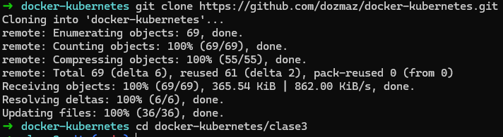   


2. Levantar Servicios:  
   ```bash
   docker compose up -d
   ```

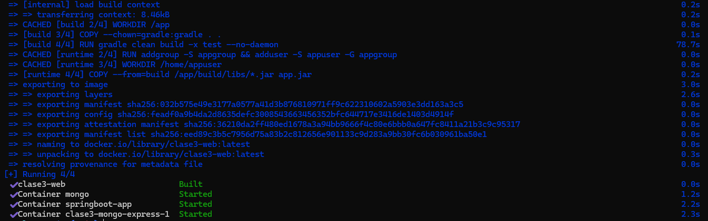


3. Acceder (API):

* http://localhost:8080/api/productos

* http://localhost:8080/api/productos/68e5df061e4763594b7d6843


## Verificación

1. Servicios corriendo:
   ```bash
   docker compose ps
    ```
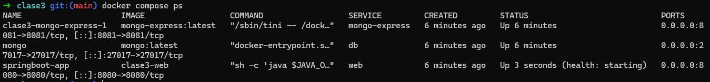
   
2. Acceder a la web

* **Listar todos los datos de la base de datos**

   http://localhost:8080/api/productos


* **Listar un producto de la base de datos por ID**

   http://localhost:8080/api/productos/68e5df061e4763594b7d6843


* **Acceder a la base de datos (mongo-express)**

   http://localhost:8081/db/test/productos


3. Verificar volumen persiste:

```bash
docker compose down
```

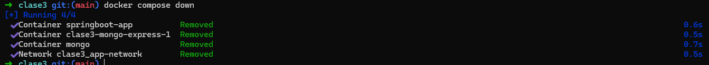


```bash
docker compose up -d
```

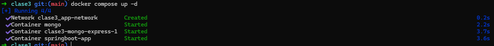


```bash
docker volume ls 
```

4. Verificar red creada:

```bash
docker network ls
```

Probar ping del contenedor springboot-app al contenedor mongo:

```bash
docker exec springboot-app ping -c 2 mongo
```

Probar ping del contenedor mongo al contenedor mongo-express:

```bash
docker exec -it mongo bash      # ingrersar a la terminal del contenedor mongo

apt-get update && apt-get install -y iputils-ping   # instalar ping
exit   # salir del contenedor mongo

docker exec mongo ping -c 2 springboot-app     # probar ping al contenedor springboot-app
docker exec mongo ping -c 2 mongo-express      # probar ping al contenedor mongo
```

## Capturas de Pantalla


* Servicios corriendo


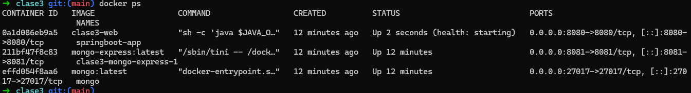


* Red creada (**clase3_app-network**)

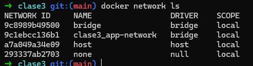

* Ping entre contenedores

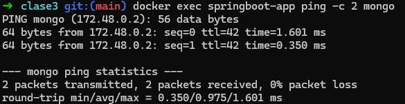

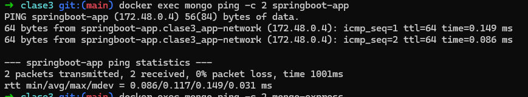

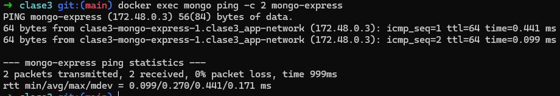


* volumen creado (**clase3_mongo_data**)

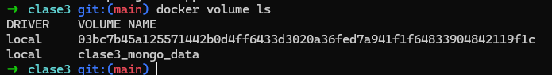


* API funcionando


**Listar todos los datos de la base de datos**

http://localhost:8080/api/productos

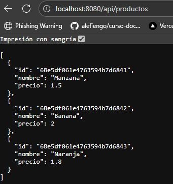

**Listar un producto de la base de datos por ID**

http://localhost:8080/api/productos/68e5df061e4763594b7d6843

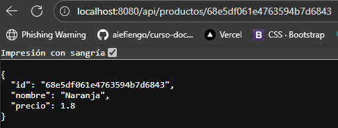

**Acceder a la base de datos (mongo-express)**

http://localhost:8081/db/test/productos

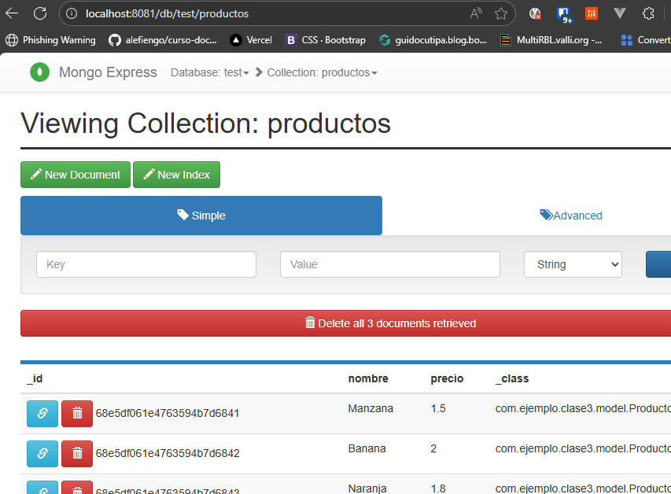
