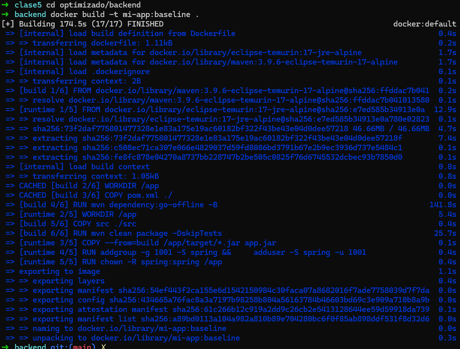
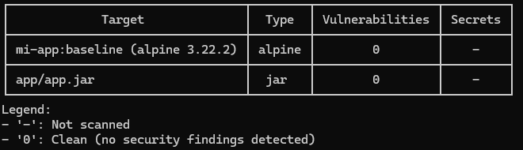
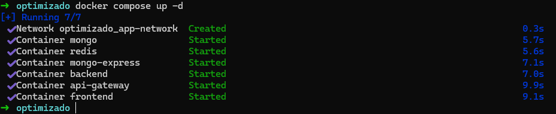
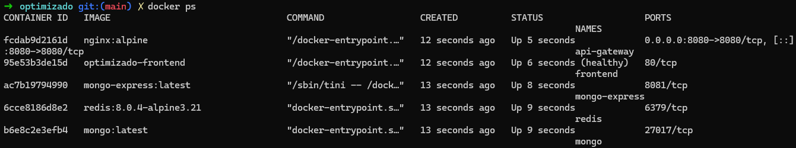
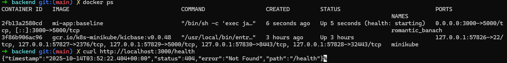

# Título: "Docker Optimización y seguridad"


## Título y Descripción
* Nombre del proyecto: ABM productos
* Descripción de la aplicación:

  Aplicación de gestión de productos con arquitectura de microservicios, utilizando un gateway para enrutar solicitudes, un servicio backend desarrollado en Spring Boot, una base de datos MongoDB para persistencia de datos y Redis para caching. La aplicación incluye un frontend en Angular servido a través de Nginx y un administrador de base de datos mongo-express.

* Objetivo de optimización 

## Tecnologías Utilizadas
- Spring boot
- MongoDB 
- Angular
- Docker & Docker Compose
- Trivy para escaneo de seguridad

## Mejoras Aplicadas
   Lista detallada de cada optimización:

### Cambios en Imágenes Base
* maven:3.9.6-eclipse-temurin-17-alpine en reemplazo de gradle:8.14.3-jdk17-alpine
* eclipse-temurin:17-jre-alpine en reemplazo de openjdk:17-alpine

### Creación de usuario No Root
````
RUN addgroup -g 1001 -S spring && \
    adduser -S spring -u 1001
RUN chown -R spring:spring /app
USER spring
````

### Uso de variables de entorno
````
ENV JAVA_OPTS="-XX:+UseContainerSupport -XX:MaxRAMPercentage=75.0 -XX:+UseG1GC -XX:+DisableExplicitGC"
````

### Multi-Stage Build
La configuración ya contaba con multi-stage build, pero se optimizó aún más cambiando las imágenes base.

## Mejoras de Seguridad y Optimización

### 1. Multi-Stage Build (backend)
- **Antes**: gradle:8.14.3-jdk17-alpine   y   openjdk:17-alpine    (592MB)
- **Después**: maven:3.9.6-eclipse-temurin-17-alpine  y   eclipse-temurin:17-jre-alpine   (252MB)


- **Beneficio**: Reducción de **~340MB** en imagen final

### 2. Imagen Base Alpine (frontend)
- **Antes**: node:18-alpine (74.5GB)
- **Después**: node:18-alpine (74.5MB)
- **Beneficio**: 0% ya se utilizaba la versión alpine


### 3. Usuario Non-Root
- **Antes**: Ejecuta como root (riesgo de seguridad)
- **Después**: Usuario appuser (UID 1001)
- **Beneficio**: Previene escalación de privilegios

### 4. Health Check
- **Implementación**: Verificación cada 30s
- **Beneficio**: Docker detecta containers no saludables

### 5. Labels de Seguridad
- **Implementación**: Metadata en imagen
- **Beneficio**: Trazabilidad y auditoría
4. Tabla Comparativa
   Incluye la tabla de comparación antes/después.

5. Análisis de Vulnerabilidades
## Análisis de Vulnerabilidades

### Vulnerabilidades Críticas Resueltas

1. **CVE-2024-XXXXX** - Vulnerability en libssl
    - Severidad: CRITICAL
    - Fix: Actualización a alpine:3.19

2. **CVE-2024-YYYYY** - Buffer overflow en biblioteca X
    - Severidad: HIGH
    - Fix: Removida al usar imagen alpine minimal
6. Instrucciones de Uso
# Clonar repositorio
git clone <tu-repo>

# Construir imagen optimizada
```bash
cd optimizado/backend
```
```bash
docker build -t mi-app:baseline 
```



# Escanear con Trivy
```bash
trivy image mi-app:baseline  --timeout 15m 
```



# Levantar servicios
```bash
docker compose up -d
```



# Verificar salud
```bash
docker ps
```



```bash
curl http://localhost:3000/health
```


7. Verificación de Seguridad
   Checklist que puedes copiar:

## Checklist de Seguridad

- [x] Escaneo con Trivy (0 CRITICAL)
- [x] Usuario non-root verificado
- [x] Multi-stage build implementado
- [x] Imagen base alpine utilizada
- [x] Health check funcional
- [x] Labels de metadata agregados
- [x] .dockerignore configurado
- [x] Sin secretos hardcoded en código