# NGINX con kubernetes

**Curso:** Docker & Kubernetes - Clase 6

**Estudiante:** GUIDO CUTIPA YUJRA

Despliega una instancia de Nginx en un clúster local con Minikube, creando un Deployment de 3 réplicas y un Service para exponer la aplicación.
Incluye un ConfigMap para el contenido web y comandos para verificar, escalar y observar la auto-recuperación de pods.

## Stack

- **Aplicación:** Nginx.
- **Kubernetes:** minikube
- **Réplicas:** 3

## Ejecución

1. Clonar:
   ```bash
   git clone https://github.com/dozmaz/docker-kubernetes.git
   cd docker-kubernetes/clase6
   ```
2. Desplegar:
```bash
kubectl apply -f deployment.yaml
kubectl apply -f service.yaml
```

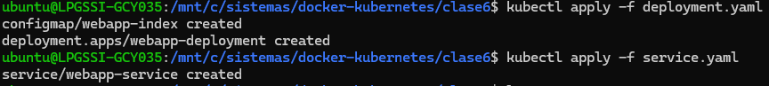

3. Acceder:
```bash
http://127.0.0.1:36343/
```
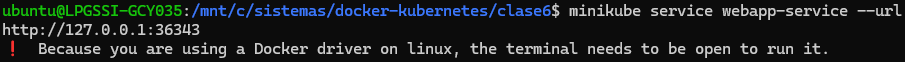

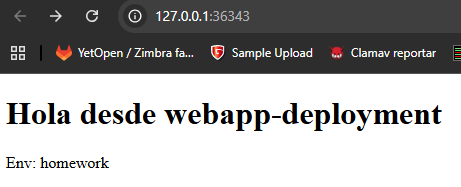

```bash

minikube service webapp-service
```
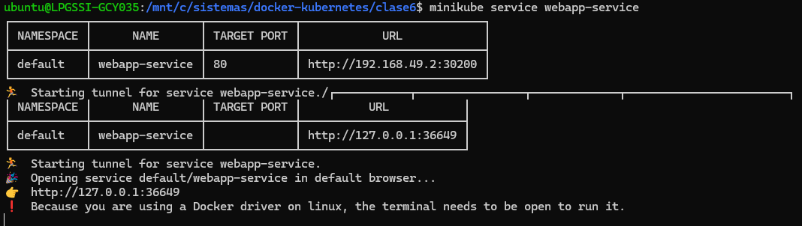

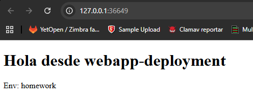


4. Cómo Probar

### Verificación

1. Ver recursos:
```bash
kubectl get all
```


```bash
kubectl get pods
```
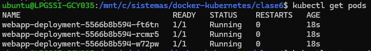


```bash
kubectl get services
```
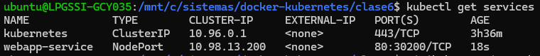


## Experimentar con kubernetes


```bash
# 1. Ver todos los recursos
kubectl get all
```
```
Name:                   webapp-deployment
Namespace:              default
CreationTimestamp:      Fri, 17 Oct 2025 17:06:16 -0400
Labels:                 app=webapp
                        env=homework
Annotations:            deployment.kubernetes.io/revision: 1
Selector:               app=webapp
Replicas:               3 desired | 3 updated | 3 total | 3 available | 0 unavailable
StrategyType:           RollingUpdate
MinReadySeconds:        0
RollingUpdateStrategy:  25% max unavailable, 25% max surge
Pod Template:
  Labels:  app=webapp
           env=homework
  Containers:
   webapp:
    Image:        nginx:alpine
    Port:         80/TCP
    Host Port:    0/TCP
    Environment:  <none>
    Mounts:
      /usr/share/nginx/html/index.html from web-content (rw,path="index.html")
  Volumes:
   web-content:
    Type:          ConfigMap (a volume populated by a ConfigMap)
    Name:          webapp-index
    Optional:      false
  Node-Selectors:  <none>
  Tolerations:     <none>
Conditions:
  Type           Status  Reason
  ----           ------  ------
  Available      True    MinimumReplicasAvailable
  Progressing    True    NewReplicaSetAvailable
OldReplicaSets:  <none>
NewReplicaSet:   webapp-deployment-5566b8b594 (3/3 replicas created)
Events:
  Type    Reason             Age   From                   Message
  ----    ------             ----  ----                   -------
  Normal  ScalingReplicaSet  14m   deployment-controller  Scaled up replica set webapp-deployment-5566b8b594 from 0 to 3
```

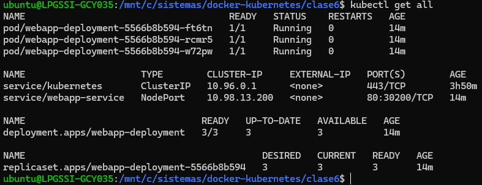


```bash
# 2. Ver detalles del deployment
kubectl describe deployment webapp-deployment
```
```
Name:                   webapp-deployment
Namespace:              default
CreationTimestamp:      Fri, 17 Oct 2025 17:06:16 -0400
Labels:                 app=webapp
                        env=homework
Annotations:            deployment.kubernetes.io/revision: 1
Selector:               app=webapp
Replicas:               3 desired | 3 updated | 3 total | 3 available | 0 unavailable
StrategyType:           RollingUpdate
MinReadySeconds:        0
RollingUpdateStrategy:  25% max unavailable, 25% max surge
Pod Template:
  Labels:  app=webapp
           env=homework
  Containers:
   webapp:
    Image:        nginx:alpine
    Port:         80/TCP
    Host Port:    0/TCP
    Environment:  <none>
    Mounts:
      /usr/share/nginx/html/index.html from web-content (rw,path="index.html")
  Volumes:
   web-content:
    Type:          ConfigMap (a volume populated by a ConfigMap)
    Name:          webapp-index
    Optional:      false
  Node-Selectors:  <none>
  Tolerations:     <none>
Conditions:
  Type           Status  Reason
  ----           ------  ------
  Available      True    MinimumReplicasAvailable
  Progressing    True    NewReplicaSetAvailable
OldReplicaSets:  <none>
NewReplicaSet:   webapp-deployment-5566b8b594 (3/3 replicas created)
Events:
  Type    Reason             Age   From                   Message
  ----    ------             ----  ----                   -------
  Normal  ScalingReplicaSet  14m   deployment-controller  Scaled up replica set webapp-deployment-5566b8b594 from 0 to 3
```

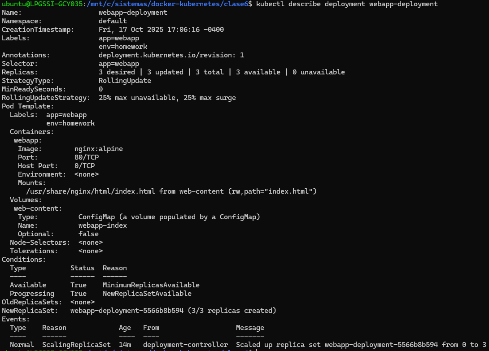


```bash
# 3. Ver logs de uno de los pods
kubectl get pods -l app=webapp
```
```
NAME                                 READY   STATUS    RESTARTS   AGE
webapp-deployment-5566b8b594-ft6tn   1/1     Running   0          18m
webapp-deployment-5566b8b594-rcmr5   1/1     Running   0          18m
webapp-deployment-5566b8b594-w72pw   1/1     Running   0          18m
```
```bash
kubectl logs webapp-deployment-5566b8b594-ft6tn
```
```
/docker-entrypoint.sh: /docker-entrypoint.d/ is not empty, will attempt to perform configuration
/docker-entrypoint.sh: Looking for shell scripts in /docker-entrypoint.d/
/docker-entrypoint.sh: Launching /docker-entrypoint.d/10-listen-on-ipv6-by-default.sh
10-listen-on-ipv6-by-default.sh: info: Getting the checksum of /etc/nginx/conf.d/default.conf
10-listen-on-ipv6-by-default.sh: info: Enabled listen on IPv6 in /etc/nginx/conf.d/default.conf
/docker-entrypoint.sh: Sourcing /docker-entrypoint.d/15-local-resolvers.envsh
/docker-entrypoint.sh: Launching /docker-entrypoint.d/20-envsubst-on-templates.sh
/docker-entrypoint.sh: Launching /docker-entrypoint.d/30-tune-worker-processes.sh
/docker-entrypoint.sh: Configuration complete; ready for start up
2025/10/17 21:06:27 [notice] 1#1: using the "epoll" event method
2025/10/17 21:06:27 [notice] 1#1: nginx/1.29.2
2025/10/17 21:06:27 [notice] 1#1: built by gcc 14.2.0 (Alpine 14.2.0)
2025/10/17 21:06:27 [notice] 1#1: OS: Linux 6.6.87.2-microsoft-standard-WSL2
2025/10/17 21:06:27 [notice] 1#1: getrlimit(RLIMIT_NOFILE): 1048576:1048576
2025/10/17 21:06:27 [notice] 1#1: start worker processes
2025/10/17 21:06:27 [notice] 1#1: start worker process 30
2025/10/17 21:06:27 [notice] 1#1: start worker process 31
2025/10/17 21:06:27 [notice] 1#1: start worker process 32
2025/10/17 21:06:27 [notice] 1#1: start worker process 33
2025/10/17 21:06:27 [notice] 1#1: start worker process 34
2025/10/17 21:06:27 [notice] 1#1: start worker process 35
2025/10/17 21:06:27 [notice] 1#1: start worker process 36
2025/10/17 21:06:27 [notice] 1#1: start worker process 37
2025/10/17 21:06:27 [notice] 1#1: start worker process 38
2025/10/17 21:06:27 [notice] 1#1: start worker process 39
2025/10/17 21:06:27 [notice] 1#1: start worker process 40
2025/10/17 21:06:27 [notice] 1#1: start worker process 41
2025/10/17 21:06:27 [notice] 1#1: start worker process 42
2025/10/17 21:06:27 [notice] 1#1: start worker process 43
10.244.0.1 - - [17/Oct/2025:21:15:04 +0000] "GET / HTTP/1.1" 200 182 "-" "Mozilla/5.0 (Windows NT 10.0; Win64; x64) AppleWebKit/537.36 (KHTML, like Gecko) Chrome/141.0.0.0 Safari/537.36" "-"
2025/10/17 21:15:04 [error] 30#30: *1 open() "/usr/share/nginx/html/favicon.ico" failed (2: No such file or directory), client: 10.244.0.1, server: localhost, request: "GET /favicon.ico HTTP/1.1", host: "127.0.0.1:36343", referrer: "http://127.0.0.1:36343/"
10.244.0.1 - - [17/Oct/2025:21:15:04 +0000] "GET /favicon.ico HTTP/1.1" 404 555 "http://127.0.0.1:36343/" "Mozilla/5.0 (Windows NT 10.0; Win64; x64) AppleWebKit/537.36 (KHTML, like Gecko) Chrome/141.0.0.0 Safari/537.36" "-"
```

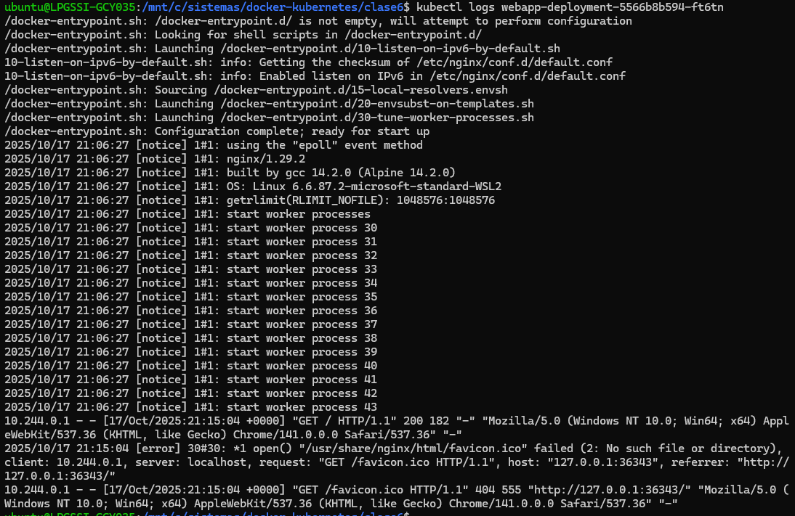


```bash
# 4. Escalar a 5 réplicas
kubectl scale deployment webapp-deployment --replicas=5
kubectl get pods
```
```
deployment.apps/webapp-deployment scaled
```
```
NAME                                 READY   STATUS    RESTARTS   AGE
webapp-deployment-5566b8b594-ft6tn   1/1     Running   0          20m
webapp-deployment-5566b8b594-jwx6t   1/1     Running   0          20s
webapp-deployment-5566b8b594-rcmr5   1/1     Running   0          20m
webapp-deployment-5566b8b594-s5dm5   1/1     Running   0          20s
webapp-deployment-5566b8b594-w72pw   1/1     Running   0          20m
```

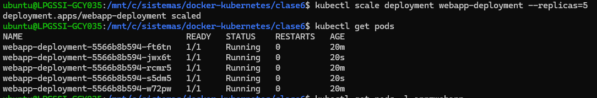


```bash
# 5. Eliminar un pod y observar auto-healing
kubectl delete pod webapp-deployment-5566b8b594-w72pw 
kubectl get pods -w
```
```
NAME                                 READY   STATUS    RESTARTS   AGE
webapp-deployment-5566b8b594-ft6tn   1/1     Running   0          21m
webapp-deployment-5566b8b594-g7bcl   1/1     Running   0          5s
webapp-deployment-5566b8b594-jwx6t   1/1     Running   0          76s
webapp-deployment-5566b8b594-rcmr5   1/1     Running   0          21m
webapp-deployment-5566b8b594-s5dm5   1/1     Running   0          76s
```

**Se creo este pod  webapp-deployment-5566b8b594-g7bcl  para reemplazar al eliminado**

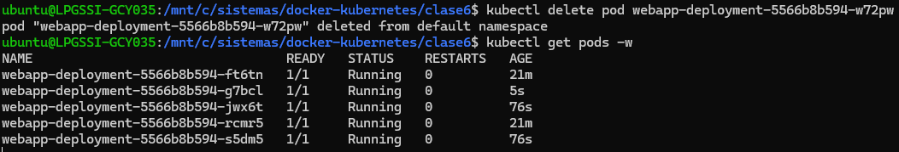


```bash
kubectl get all
```
```
NAME                                     READY   STATUS    RESTARTS   AGE
pod/webapp-deployment-5566b8b594-ft6tn   1/1     Running   0          22m
pod/webapp-deployment-5566b8b594-g7bcl   1/1     Running   0          82s
pod/webapp-deployment-5566b8b594-jwx6t   1/1     Running   0          2m33s
pod/webapp-deployment-5566b8b594-rcmr5   1/1     Running   0          22m
pod/webapp-deployment-5566b8b594-s5dm5   1/1     Running   0          2m33s

NAME                     TYPE        CLUSTER-IP     EXTERNAL-IP   PORT(S)        AGE
service/kubernetes       ClusterIP   10.96.0.1      <none>        443/TCP        3h59m
service/webapp-service   NodePort    10.98.13.200   <none>        80:30200/TCP   22m

NAME                                READY   UP-TO-DATE   AVAILABLE   AGE
deployment.apps/webapp-deployment   5/5     5            5           22m

NAME                                           DESIRED   CURRENT   READY   AGE
replicaset.apps/webapp-deployment-5566b8b594   5         5         5       22m
```

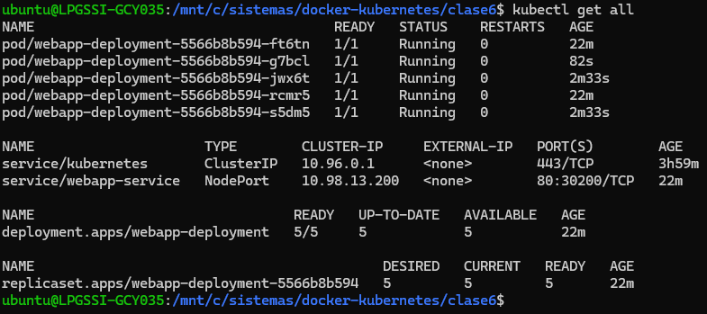