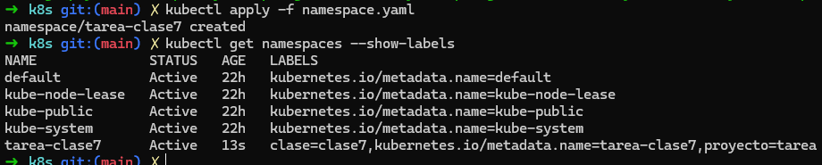
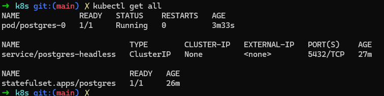
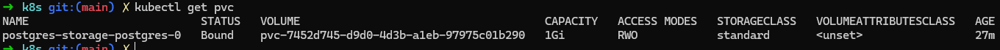
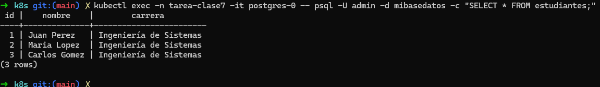
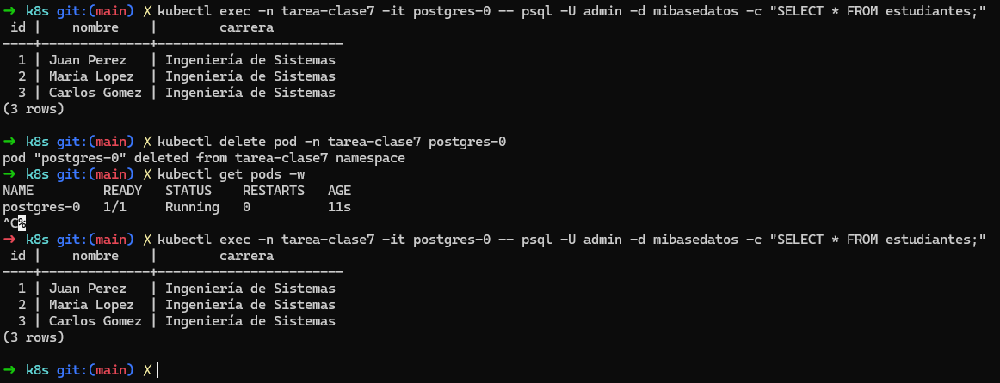
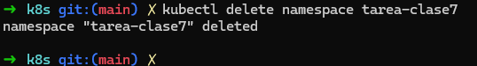
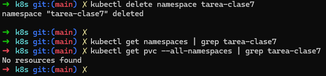

# PostgreSQL con Kubernetes
Curso: Docker & Kubernetes - Clase 7 

Estudiante: GUIDO CUTIPA YUJRA

PostgreSQL en Kubernetes usando Namespace, ConfigMap, Secret, StatefulSet y PVC.
Incluye pasos para aplicar manifiestos, comandos kubectl para verificar recursos y logs, y pruebas para demostrar persistencia de datos.

## Descripción:

Objetivo de la tarea

Conceptos aplicados (namespace, configmap, secret, statefulset, pvc)

## Instrucciones paso a paso:

* Clonar:

```bash
git clone https://github.com/dozmaz/docker-kubernetes.git
cd docker-kubernetes/clase7
```
  
* Crear namespace
```bash
cd k8s
```
```bash
kubectl apply -f namespace.yaml
```
```bash
kubectl config set-context --current --namespace=tarea-clase7
```
```bash
kubectl get namespaces --show-labels
```


* Aplicar ConfigMap

```bash
kubectl apply -f configmap.yaml
```

* Aplicar Secret
```bash
cp secret.yaml.example secret.yaml
kubectl apply -f secret.yaml
```
* Aplicar Headless Service
```bash
kubectl apply -f postgres-headless.yaml
```

* Aplicar StatefulSet
```bash
kubectl apply -f postgres-statefulset.yaml
```

* Verificar que todo está corriendo
```bash
# Verificar namespace y recursos
kubectl get namespace tarea-clase7
kubectl config set-context --current --namespace=tarea-clase7
kubectl get all -n tarea-clase7
kubectl get pods -n tarea-clase7 -o wide

# StatefulSet, ConfigMap, Secret y PVCs
kubectl get statefulset -n tarea-clase7
kubectl describe statefulset postgres -n tarea-clase7
kubectl get pvc -n tarea-clase7
kubectl describe pvc postgres-storage-postgres-0 -n tarea-clase7
kubectl get configmap,secret -n tarea-clase7

# Logs y descripción de pod 
kubectl logs -n tarea-clase7 postgres-0 --tail=200
kubectl describe pod postgres-0 -n tarea-clase7

# Eventos recientes 
kubectl get events -n tarea-clase7 --sort-by='.metadata.creationTimestamp'
```


* Probar PostgreSQL
```bash
# Ver versión
kubectl exec -n tarea-clase7 -it postgres-0 -- psql -U admin -d mibasedatos -c "SELECT version();"
# Crear tabla, insertar y consultar
kubectl exec -n tarea-clase7 -it postgres-0 -- psql -U admin -d mibasedatos -c "CREATE TABLE IF NOT EXISTS test_persist(id serial PRIMARY KEY, v text);"
kubectl exec -n tarea-clase7 -it postgres-0 -- psql -U admin -d mibasedatos -c "INSERT INTO test_persist(v) VALUES('hola desde kubernetes');"
kubectl exec -n tarea-clase7 -it postgres-0 -- psql -U admin -d mibasedatos -c "SELECT * FROM test_persist;"
```

* Demostrar persistencia
### Crear tabla, insertar y consultar
```bash
kubectl exec -n tarea-clase7 -it postgres-0 -- psql -U admin -d mibasedatos -c "CREATE TABLE estudiantes (id SERIAL PRIMARY KEY,nombre VARCHAR(100),carrera VARCHAR(100));"
kubectl exec -n tarea-clase7 -it postgres-0 -- psql -U admin -d mibasedatos -c "INSERT INTO estudiantes (nombre, carrera) VALUES('Juan Perez', 'Ingeniería de Sistemas'),('Maria Lopez', 'Ingeniería de Sistemas'),('Carlos Gomez', 'Ingeniería de Sistemas');"
kubectl exec -n tarea-clase7 -it postgres-0 -- psql -U admin -d mibasedatos -c "SELECT * FROM estudiantes;"
```
```bash
# Borrar el pod para forzar recreación por StatefulSet
kubectl delete pod -n tarea-clase7 postgres-0

# Esperar a que el pod vuelva a estar Ready
kubectl wait --for=condition=ready pod/postgres-0 -n tarea-clase7 --timeout=180s

kubectl get pods -w

# Volver a consultar para verificar que los datos persisten
kubectl exec -n tarea-clase7 -it postgres-0 -- psql -U admin -d mibasedatos -c "SELECT * FROM estudiantes;"
```

## Comandos de verificación:
```bash
kubectl get all -n tarea-clase7
kubectl get pvc -n tarea-clase7
kubectl get configmap,secret -n tarea-clase7
```

## Capturas de pantalla:
1. `kubectl get all` mostrando todos los recursos



2. `kubectl get pvc` mostrando el volumen BOUND



3. Datos en PostgreSQL (SELECT)



4. Prueba de persistencia (después de eliminar pod)



## Comandos de limpieza:
```bash
kubectl delete namespace tarea-clase7
# Esto elimina todo: pods, services, configmaps, secrets, pvcs
```


Verificar

```bash
kubectl get namespaces | grep tarea-clase7
kubectl get pvc --all-namespaces | grep tarea-clase7
```
