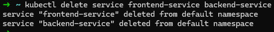

# Despliegue y pruebas - Clase 8

Curso: Docker & Kubernetes - Clase 8

Estudiante: GUIDO CUTIPA YUJRA


## a) Descripción del proyecto
- Stack desplegado:
  - Frontend: Angular (aplicación estática servida por nginx) — deployment `frontend` / service `frontend-service`.
  - Backend: Servicio REST (Spring Boot/Java) — deployment `backend` / service `backend-service`.

- Conceptos aplicados:
  - Ingress (controlador para exponer rutas HTTP externas al clúster).
  - Probes de salud: liveness y readiness para validar estado de los contenedores.
  - HPA (Horizontal Pod Autoscaler) para escalar el backend según uso de CPU.
  - Services y Deployments para la gestión de pods y exposición interna.

---

## b) Instrucciones de despliegue

* Clonar:

```bash
git clone https://github.com/dozmaz/docker-kubernetes.git
cd docker-kubernetes/clase8/k8s/
```

1) Iniciar Minikube y habilitar addons necesarios (desde Windows `cmd.exe` o una terminal):

```bash
minikube start
minikube addons enable ingress
minikube addons enable metrics-server
```

Resultado obtenido
```bash
➜  k8s minikube start
😄  minikube v1.37.0 on Ubuntu 24.04 (kvm/amd64)
✨  Using the docker driver based on existing profile
👍  Starting "minikube" primary control-plane node in "minikube" cluster
🚜  Pulling base image v0.0.48 ...
🔄  Restarting existing docker container for "minikube" ...
🐳  Preparing Kubernetes v1.34.0 on Docker 28.4.0 ...
🔎  Verifying Kubernetes components...
    ▪ Using image gcr.io/k8s-minikube/storage-provisioner:v5
🌟  Enabled addons: default-storageclass, storage-provisioner
🏄  Done! kubectl is now configured to use "minikube" cluster and "default" namespace by default
➜  k8s minikube addons enable ingress
💡  ingress is an addon maintained by Kubernetes. For any concerns contact minikube on GitHub.
You can view the list of minikube maintainers at: https://github.com/kubernetes/minikube/blob/master/OWNERS
    ▪ Using image registry.k8s.io/ingress-nginx/kube-webhook-certgen:v1.6.2
    ▪ Using image registry.k8s.io/ingress-nginx/kube-webhook-certgen:v1.6.2
    ▪ Using image registry.k8s.io/ingress-nginx/controller:v1.13.2
🔎  Verifying ingress addon...
🌟  The 'ingress' addon is enabled
➜  k8s git:(main) ✗ minikube addons enable metrics-server
💡  metrics-server is an addon maintained by Kubernetes. For any concerns contact minikube on GitHub.
You can view the list of minikube maintainers at: https://github.com/kubernetes/minikube/blob/master/OWNERS
    ▪ Using image registry.k8s.io/metrics-server/metrics-server:v0.8.0
🌟  The 'metrics-server' addon is enabled
➜  k8s git:(main) ✗
```


2) Aplicar los manifiestos Kubernetes (desde la carpeta `clase8/k8s`):

```bash
cd clase8
kubectl apply -f k8s/
```
Resultado obtenido
```bash
➜  k8s git:(main) ✗ kubectl apply -f ../k8s/
deployment.apps/backend created
service/backend-service created
deployment.apps/frontend created
service/frontend-service created
horizontalpodautoscaler.autoscaling/backend-hpa created
ingress.networking.k8s.io/app-ingress created
```

3) Verificar recursos básicos:

```bash
kubectl get pods
```

Resultado obtenido:
```bash
➜  k8s git:(main) ✗ kubectl get pods
NAME                        READY   STATUS    RESTARTS   AGE
backend-b9b5cc476-6qvpq     1/1     Running   0          104s
backend-b9b5cc476-kx4gp     1/1     Running   0          104s
frontend-55b84b596d-c2dpp   1/1     Running   0          104s
frontend-55b84b596d-rrp54   1/1     Running   0         
```

```bash
kubectl get svc
```

Resultado obtenido:
```bash
➜  k8s git:(main) ✗ kubectl get svc
NAME               TYPE        CLUSTER-IP      EXTERNAL-IP   PORT(S)   AGE
backend-service    ClusterIP   10.98.190.154   <none>        80/TCP    3m18s
frontend-service   ClusterIP   10.98.241.194   <none>        80/TCP    3m18s
kubernetes         ClusterIP   10.96.0.1       <none>        443/TCP   2d23h
```

```bash
kubectl get ingress
```

Resultado obtenido:
```bash
➜  k8s git:(main) ✗ kubectl get ingress
NAME          CLASS   HOSTS   ADDRESS        PORTS   AGE
app-ingress   nginx   *       192.168.49.2   80      3m45s
```

```bash
kubectl get hpa
```

Resultado obtenido:
```bash
➜  k8s git:(main) ✗ kubectl get hpa
NAME          REFERENCE            TARGETS       MINPODS   MAXPODS   REPLICAS   AGE
backend-hpa   Deployment/backend   cpu: 3%/50%   2         5         2          4m
```

4) Probar Ingress (ejemplo con Minikube):

```bash
kubectl get pods -n ingress-nginx
```

Resultado obtenido:

```bash
➜  k8s git:(main) ✗ kubectl get pods -n ingress-nginx
NAME                                       READY   STATUS      RESTARTS      AGE
ingress-nginx-admission-create-ffw89       0/1     Completed   0             22h
ingress-nginx-admission-patch-zdfjc        0/1     Completed   0             22h
ingress-nginx-controller-9cc49f96f-jlmft   1/1     Running     1 (14m ago)   22h
```

- Obtener IP de Minikube:

```bash
minikube ip
```

Resultado obtenido:
```bash
➜  k8s git:(main) ✗ minikube ip
192.168.49.2
```


- Probar rutas del Ingress:

```bash
curl http://192.168.49.2/
```

Resultado obtenido:


```bash
curl http://192.168.49.2/api
```

### Si no funciona probar con un portforwarding temporal:

```bash
kubectl port-forward svc/backend-service 8080:80
```


```bash
curl http://localhost:8080/api
```

Resultado obtenido:

```bash
StatusCode        : 200
StatusDescription : OK
Content           :

                    Hostname: backend-b9b5cc476-6qvpq

                    Pod Information:
                        -no pod information available-

                    Server values:
                        server_version=nginx: 1.13.3 - lua: 10008

                    Request Information:
                        client_address=127.0.0.1
                        method...
RawContent        : HTTP/1.1 200 OK
                    Transfer-Encoding: chunked
                    Connection: keep-alive
                    Content-Type: text/plain
                    Date: Tue, 21 Oct 2025 02:20:45 GMT
                    Server: echoserver


                    Hostname: backend-b9b5cc476-6qvpq

                    Pod Infor...
Forms             : {}
Headers           : {[Transfer-Encoding, chunked], [Connection,
                    keep-alive], [Content-Type, text/plain], [Date,
                    Tue, 21 Oct 2025 02:20:45 GMT]...}
Images            : {}
InputFields       : {}
Links             : {}
ParsedHtml        : mshtml.HTMLDocumentClass
RawContentLength  : 504
```


```bash
curl http://localhost:8080/
```

Resultado obtenido:

```bash
StatusCode        : 200
StatusDescription : OK
Content           :

                    Hostname: backend-b9b5cc476-6qvpq

                    Pod Information:
                        -no pod information available-

                    Server values:
                        server_version=nginx: 1.13.3 - lua: 10008

                    Request Information:
                        client_address=127.0.0.1
                        method...
RawContent        : HTTP/1.1 200 OK
                    Transfer-Encoding: chunked
                    Connection: keep-alive
                    Content-Type: text/plain
                    Date: Tue, 21 Oct 2025 02:22:53 GMT
                    Server: echoserver


                    Hostname: backend-b9b5cc476-6qvpq

                    Pod Infor...
Forms             : {}
Headers           : {[Transfer-Encoding, chunked], [Connection,
                    keep-alive], [Content-Type, text/plain], [Date,
                    Tue, 21 Oct 2025 02:22:53 GMT]...}
Images            : {}
InputFields       : {}
Links             : {}
ParsedHtml        : mshtml.HTMLDocumentClass
RawContentLength  : 475
```


5) Probar HPA con carga (ejemplo simple usando un Pod generador de carga):

- Comprobar el HPA del backend (nombre de ejemplo `backend-hpa`):

```bash
kubectl get hpa backend-hpa
```

Resultado obtenido:
```bash
NAME          REFERENCE            TARGETS       MINPODS   MAXPODS   REPLICAS   AGE
backend-hpa   Deployment/backend   cpu: 1%/50%   2         5         2          23h
```


- Crear un pod que haga peticiones continuas al backend para forzar escalado (ejemplo con busybox):

```bash
kubectl run -it --rm load-generator --image=busybox -- /bin/sh -c "while true; do wget -q -O- http://backend-service:8080/api >/dev/null; sleep 0.1; done"
```

## c) Comandos de verificación

Usa estos comandos para comprobar el estado del clúster y el comportamiento del HPA / Ingress:

```bash
kubectl get all
kubectl get ingress
kubectl get hpa
kubectl top pods
```


## d) Capturas de pantalla (recomendadas)

Toma y guarda capturas que muestren lo siguiente:

1. Ingress funcionando: salida de `curl http://localhost:8080/api` y `curl http://localhost:8080/`.


2. Health probes configurados: salida de `kubectl describe pod backend-b9b5cc476-6qvpq` mostrando `Liveness` y `Readiness` probes.


3. HPA en reposo: `kubectl get hpa` mostrando TARGETS por debajo del umbral (ej. 0%/50%).


4. HPA escalando bajo carga: `kubectl get hpa` mostrando TARGETS > 50% y aumento en `DESIRED`.


5. Pods escalados: `kubectl get pods` mostrando aumento de réplicas (por ejemplo de 2 a 4-5).


Consejo: para la captura del `describe pod`, puedes filtrar las secciones con:


## e) Comandos de limpieza

Para eliminar los recursos creados por esta práctica (ajusta nombres si tus manifests usan otros):

```bash
kubectl delete ingress app-ingress
```


```bash
kubectl delete hpa backend-hpa
```


```bash
kubectl delete service frontend-service backend-service
```




```bash
kubectl delete deployment frontend backend
```

